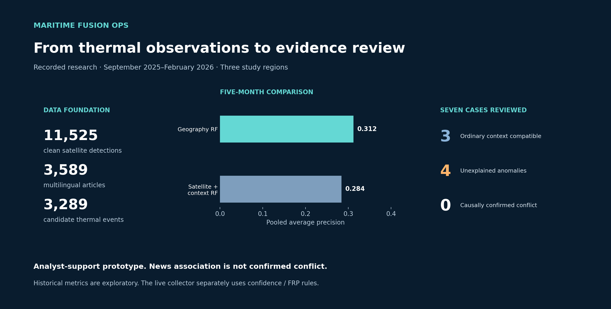
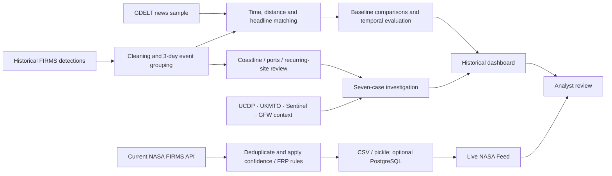

# Maritime Fusion Ops

**Satellite observations, public reporting and an auditable path to analyst review.**

A data-science portfolio project by **Jale Summak** exploring a practical question:
*Can thermal detections and conflict-related reporting be associated in time and space, and help prioritise maritime investigations?*



**What the project delivers:** a Streamlit investigation dashboard, a NASA FIRMS collector, Docker packaging, optional PostgreSQL persistence, teaching notebooks and a documented research trail.

**What the evidence supports:** an exploratory analyst-support workflow. The work has not validated autonomous conflict detection, attack forecasting or vessel attribution.

[Results](docs/results.md) · [Methods and limitations](docs/methodology.md) · [Data origins](data/README.md) · [Run the dashboard](dashboard/README.md) · [Türkçe özet](docs/ozet-tr.md)

## The result that changed the project

The February 2026 context Random Forest found **13 of 16 news-supported events**, with **15 additional flags without that label**. Its 94.1% accuracy looked encouraging.

A five-month rolling evaluation changed the interpretation. The geography-only Random Forest achieved **0.312 average precision**, compared with **0.284** for satellite + context. The tested thermal intensity features did not deliver a consistent improvement. These are exploratory historical comparisons, not a fresh deployment benchmark.

The maritime extension selected seven cases for closer examination: **three were compatible with ordinary vessel/port context, four remained unexplained, and none of those seven was causally confirmed as a conflict incident**.

## Two connected workflows



The **live collector uses explicit confidence/FRP rules**. It does not run the historical Random Forest, automatically query every evidence source, or classify new observations as conflict.

## Historical study scope

September 2025–February 2026; three broad boxes covering Gaza/Eastern Mediterranean, Red Sea/Yemen and Southern Ukraine/Black Sea. Boxes include substantial land areas.

| Stage | Recorded count | Meaning |
|---|---:|---|
| Clean FIRMS detections | 11,525 | Satellite observations |
| Clean multilingual news articles | 3,589 | Sampled reporting, not a census |
| V2 thermal events | 3,289 | Groups of observations |
| Candidate event–news pairs | 5,677 | Many-to-many associations |
| Events meeting the news-support rule | 294 | Weak association labels |
| Centroids classified as water | 132 | Approximate land-mask result |
| Priority cases reviewed | 7 | Selected subset, not all water events |

These counts represent the recorded research run. The seven-case selection is **not a measured 99.8% workload saving**, and the four unexplained cases are not four detected attacks.

## Run locally

Python 3.11+ is the intended baseline. Release smoke tests were run on Python 3.13.9 on Windows; the Dockerfile targets Python 3.12.

```bash
git clone https://github.com/jalesummak/maritime-fusion-ops.git
cd maritime-fusion-ops
python -m pip install -r dashboard/requirements.txt
python -m streamlit run dashboard/app.py
```

Open the local Streamlit URL. **No credentials are needed to open the application.** Without research files, recorded model charts remain available; the app labels missing maps and case data. It does not download historical evidence on startup.

To populate the **Live NASA Feed**, obtain your own [FIRMS MAP key](https://firms.modaps.eosdis.nasa.gov/api/area/), then run in PowerShell:

```powershell
$env:NASA_FIRMS_MAP_KEY = Read-Host "Paste only your NASA FIRMS MAP key"
$env:CHECKPOINT_DIR = Join-Path (Get-Location) "project_checkpoint"
python dashboard/live_ingest.py
```

Set the same `CHECKPOINT_DIR` when launching Streamlit. The collector stores observations and newly flagged rows separately; a repeated successful pull can return observations while adding **zero** new records.

For recurring collection and Docker instructions, see [the application guide](dashboard/README.md). Docker on a laptop is still local hosting; no public deployment is included.

## Notebooks and reproducibility

| Entry point | Purpose | Scope |
|---|---|---|
| [Simple notebook](maritime_conflict_monitoring_simple.ipynb) | Classroom walkthrough with short cells | NASA → news export → clustering → models → plots |
| [Extended teaching notebook](maritime_conflict_monitoring_clean.ipynb) | More detailed reconstruction | Adds selected reference-data steps |
| [Recorded results](docs/results.md) | Original exploratory findings | Fixed historical summaries, not recomputed on app refresh |
| [Provenance ledger](data/README.md) | Where each dataset came from | Access, missing inputs and source distinctions |

**The original BigQuery SQL and untouched news export have not been recovered for this release.** A local CSV recreated from an already-cleaned checkpoint is not a raw source. The teaching notebooks require a documented compatible news export and may produce different numbers because their rules are simplified. They do not reproduce every tuning, backtest or manual-review experiment.

No original news corpus, AIS extract, Sentinel image bundle, trained pickle model, private key or local checkpoint is published here. Downloading data from a provider does not grant this repository ownership of it. Consult each provider's access and reuse terms.

## Engineering and verification

- UTC observation and ingestion timestamps; date-scoped collection.
- Deterministic detection IDs and local duplicate suppression.
- Explicit rule-based alert reasons.
- Separate historical results, live observations and manual review status.
- CSV portability, optional PostgreSQL reads/writes and Docker Compose services.
- Offline regression tests for collector deduplication, failure redaction and an empty-install dashboard.

```bash
python -m unittest discover -s tests -v
```

[Development notes](docs/development.md) describe the tested scope and remaining work. This release has no production SLA, authenticated public deployment or independently verified conflict benchmark.

## Next evidence to collect

The next useful improvements are a reproducible news acquisition query; independently adjudicated positive **and negative** examples; longer temporal and geographic tests with uncertainty estimates; matched non-event controls; and quantified latency and review effort. Adding complexity alone is not evidence of improvement.

Source acknowledgements: NASA FIRMS, GDELT and original news publishers, UCDP, UKMTO/JMIC, World Port Index, Natural Earth, Copernicus and Global Fishing Watch. This is an independent project; provider names do not imply endorsement.
